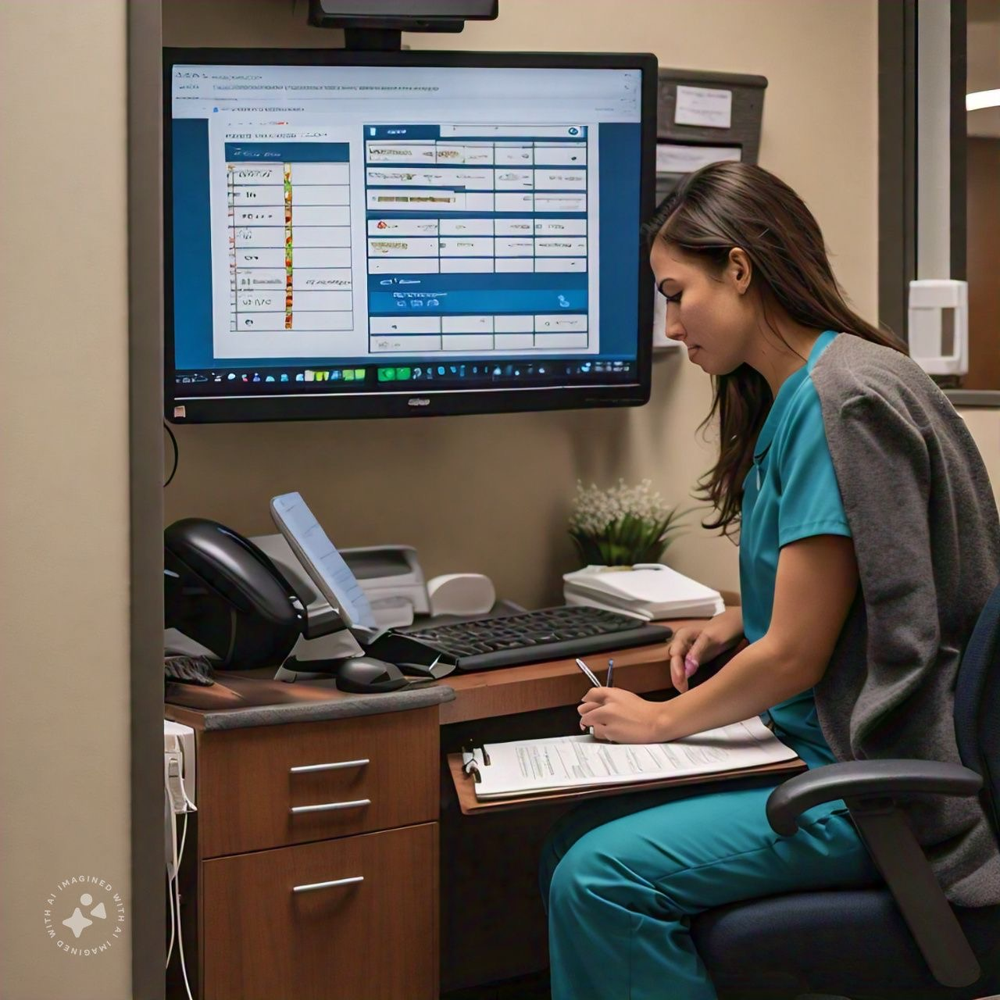
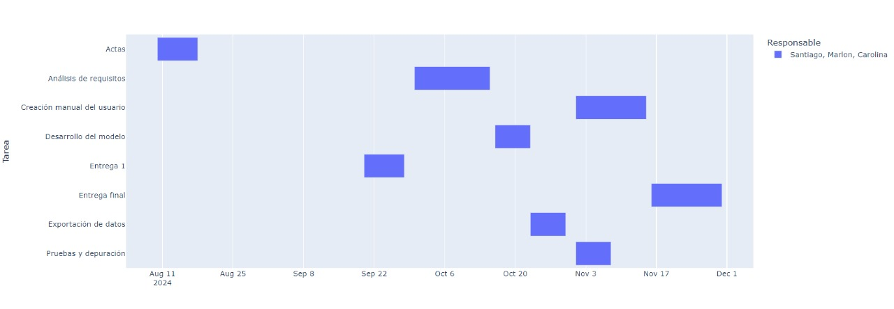

<table>
    <thead>
        <tr>
            <td rowspan="3">
                
            </td>
            <td align="center">
                <h1><b>Programación y Algoritmia</b></h1>
            </td>
            <td rowspan="3">
                
            </td>
        </tr>
        <tr>
            <td align="center">
                <h1><b>Trabajo Final</b></h1>
            </td>
        </tr>
        <tr>
            <td>
                
            </td>
        </tr>
    </thead>
</table>

<h2> <b> Por: Julián Andrés Castillo G. </b> </h2>
<a href="mailto:jandres.castillo@udea.edu.co"> ✉ Julian Andres Castillo Grisales </a>
<h2> <b> Por: Yony Fernando Ceballos. </b> </h2>
<a href="mailto:yony.ceballos@udea.edu.co"> ✉ Yony Fernando Ceballos </a>
  <h2> <b> Por: Carolina Ortega T. </b> </h2>
<a href="mailto:carolina.ortegat@udea.edu.co"> ✉ Carolina Ortega Tirado </a>
  <h2> <b> Por: Santiago Giraldo C. </b> </h2>
<a href="mailto:santiago.giraldo19@udea.edu.co"> ✉ Santiago Giraldo Cardona </a>
  <h2> <b> Por: Marlon Atehortua S. </b> </h2>
<a href="mailto:marlon.atehortua@udea.edu.co"> ✉ Marlon Atehortua Suaza </a>

 
# **Descripción del problema a solucionar -Software gestión turnos**

La EPS PailaSalud está interesada en crear un programa para la gestión de turnos y atenciones debido a que actualmente el procedimiento se realiza manualmente en donde los pacientes deben estar sentados y esperando el servicio, sin ningún tipo de atención preferencial o clasificada. Este procedimiento afecta el rendimiento del servicio y afecta el desempeño de la atención.

Para solucionar este problema los estudiantes en grupos de máximo tres integrantes, deberán crear un programa que se encargue de gestionar las personas que llegan a la EPS, producto de las citas programadas que dispone el servicio de la EPS. El software debe encargarse tanto de su llegada como de su recorrido por el sistema. El listado de las personas será proporcionado por un programa creado por la EPS (el docente entrega este programa para su uso) en un repositorio de GitHub sobre el cual los estudiantes deben hacer un clon del repositorio y continuar con su proyecto desde este punto de partida.
# **Objetivo**

Crear un programa de consola visualmente amigable al usuario, en donde permita gestionar la atención de los pacientes y registrar los datos en un dataframe , para posteriormente exportar la atención en un archivo plano (CSV) usando Python y la gestión de dos documentos. Uno proporcionado por el repositorio inicial y otro creado por el estudiante para entregar una carpeta con los listados de pacientes.
# **Reglas**

## Actas de entendimiento y compromiso.

Los integrantes del grupo deben definir su participación y responsabilidad mediante actas de entendimiento. Estas se describen a continuación:
*   ### Objetivo de entendimiento y compromiso
>Este procedimiento tiene como objetivo establecer las normas y directrices para la creación de actas de entendimiento, colaboración y responsabilidad en trabajos grupales académicos. Busca promover un ambiente de trabajo colaborativo y respetuoso, asegurando que todos los miembros del grupo comprendan y acuerden sus roles y responsabilidades.

*   ### Alcance
>Este procedimiento aplica a todos los estudiantes vinculados a un equipo para la entrega del trabajo final.
>*  #### Definiciones (Entregables)
>>*   Acta de Entendimiento: Documento que detalla los objetivos comunes del grupo y las expectativas de cada miembro respecto al proyecto.
>>*   Acta de Colaboración: Documento que especifica las metodologías de trabajo en equipo, incluyendo estrategias de comunicación y resolución de conflictos.
>>*   Acta de Responsabilidad: Documento que asigna tareas específicas a cada miembro del grupo, estableciendo plazos y criterios de evaluación.
Procedimientos (Entregables)
>>*   Convocatoria de Reunión: El grupo deberá convocar a una reunión inicial para discutir los objetivos del proyecto y elaborar el Acta de Entendimiento.
>>*   Elaboración del Acta de Entendimiento: Durante la reunión, los miembros del grupo discutirán y acordarán los objetivos y expectativas del proyecto. Esta acta será redactada por un miembro designado y luego revisada y firmada por todos los integrantes.
>>*   Elaboración del Acta de Colaboración: Posteriormente, se redactará el Acta de Colaboración, donde se definirán las normas de trabajo en equipo, incluyendo los canales y frecuencia de comunicación.
>>*   Asignación de Responsabilidades: Finalmente, se creará el Acta de Responsabilidad, detallando las tareas específicas de cada miembro, así como los plazos de entrega. Cada miembro del grupo deberá firmar este documento, aceptando sus responsabilidades.
>*  #### Seguimiento y Evaluación (Entregables)
>>*   Reuniones de Seguimiento: El grupo deberá realizar reuniones periódicas para evaluar el progreso del proyecto y hacer ajustes necesarios en las actas.
>>*   Revisión de Actas: Las actas pueden ser revisadas y modificadas con el consentimiento de todos los miembros del grupo, según sea necesario para reflejar cambios en el proyecto o en la dinámica del equipo.
>*  #### Resolución de Conflictos
>>*   En caso de desacuerdos o conflictos, el grupo deberá referirse al Acta de Colaboración para resolver la situación mediante los mecanismos previamente acordados. Si no se llega a una resolución, se consultará con el del curso para mediación.
>* **##2.Vinculos academicos y  descripción.**
>>*   Soy Santiago Giraldo, pertenezco al programa de Ingeniería Indsutrial, mi mayor fortaleza es el ingles donde tengo un certificado en B2, además tengo la habilidad de trabajar muy bien en equipo logrando una sinergia con los demás.  Soy Marlon Atehortua, curso el programa de Ingeniería Industrial, la habilidad principal mia es la resolucion de conflictos y la fortaleza  es que me adapto a las circunstancias para poder lograr los objtevios propuestos. Soy Carolina Ortega, me encuentro en el programa de Ingeniería Industrial, considero que mi habilidad más significativa es la tranquilidad y mi fortaleza es la empatía que tengo con los demás, permitiendome trabajar en equipo de manera exitosa.
## **3.	Nombre del proyecto y detalles**
 El nombre del programa es Medícalo, trata sobre la gestion de turnos en un hospital, para optimizar los tiempos y los recursos necesarios para tener una mayor calidad a la hora de atender a los pacientes, dandole información detallada de su cita.
## **4.	Licencia del software**

Definir la licencia con la cual registra el software. https://chooser-beta.creativecommons.org/

`Ingresar la licencia a utilizar aquí`
## **5.	Reporte de visión**
**Descripción general del software**:

El programa que se desarrollará será una solución para gestionar de manera eficiente la atención de los pacientes, debido a que actualmente, el proceso es manual, generando horas de esperas y mala calidad de atención para los pacientes. Este software tendrá como objetivo mejorar la organización y asignación de turnos, permitiendo que la atención sea más fluida, priorizada y ordenada. El programa funcionará en consola. A través de esta, se gestionará la llegada de los pacientes, su registro en un sistema que rastrea su recorrido por el proceso de atención, desde la entrada hasta su salida y se utilizará la información proporcionada por un sistema de citas preexistente.

**Objetivos del software**:
1. Automatizar el proceso de atención de citas.
2. Gestionar eficientemente los turnos.
3. Exportar información.
4. Integrar con el sistema existente.
   
**Beneficios del software**:
- Reducción de tiempos de espera.
- Mejor experiencia para los pacientes.
- Optimización del personal médico.
- Facilidad de uso.
- Acceso a datos históricos.

## **6.	Especificación de requisitos**

*   Los requisitos funcionales definen las acciones específicas, comportamientos, y operaciones que el software debe ejecutar para satisfacer las necesidades del usuario final.
*   Los requisitos no funcionales especifican criterios que pueden usarse para juzgar la operación del sistema, más allá de los comportamientos específicos. Esto incluye aspectos como el rendimiento, seguridad, usabilidad, fiabilidad, y compatibilidad.
### **Requisitos Funcionales:**

1. Gestión de citas y turnos:
   - El sistema debe recibir los listados de pacientes, generados por el programa.
   - El programa debe registrar la llegada de los pacientes, asignándoles un turno según el tipo de cita, el médico disponible y la prioridad del caso.
   
2. Registro de atención:
   - El sistema debe rastrear y actualizar el estado de atención del paciente a medida que avanza en el proceso.
   - Debe permitir visualizar la lista de pacientes en espera, ordenada por prioridad o tiempo de llegada.

3. Exportación de datos:
   - El sistema debe permitir la exportación de los datos de atención en un archivo, incluyendo detalles como la fecha, nombre del paciente, médico, y estado de la atención.
   
4. Notificación de cambios en el estado:
   - El programa proporcionara notificaciones o actualizaciones dentro de la consola cuando el estado de un paciente cambie. 
5. Interfaz amigable:
   - El programa debe presentar una interfaz en consola fácil de usar para los administradores del sistema, que permita visualizar, buscar, y gestionar las citas de forma intuitiva.
   
### **Requisitos No Funcionales:**

1. Rendimiento:
   - El programa debe procesar y mostrar las listas de pacientes sin retardo significativos, incluso cuando se maneje una base de datos grande. 
2. Usabilidad:
   - Los mensajes de error deben ser concretos, guiando al usuario sobre cómo solucionar cualquier problema que se presente a la hora de agendar una cita o durante el proceso de esta.
3. Compatibilidad:
   - El programa debe ser compatible con diferentes sistemas operativos que soporten Python.
5. Fiabilidad:
   - El sistema debe registrar correctamente los datos de llegada, atención y exportación, sin pérdida de información o corrupción de los datos durante su funcionamiento.
6. Seguridad:
 - Aunque no es un sistema de alta seguridad, el software  garantiza que los datos exportados no sean manipulados sin autorización y que los archivos generados estén protegidos contra modificaciones no deseadas.

## **7.	Plan de proyecto**

-Actas: Realización de actas de entendimiento y compromiso en la fase inicial del proyecto.    
-Entrega 1: Elaboración del entregable donde se describe de manera textual las intenciones y funcionabilidad del proyecto.    
-Análisis de requisitos: Entendimiento de los requisitos exigidos para la correcta realización y ejecución del programa.    
-Desarrollo del modelo: Producción del programa que se requiere crear.    
-Exportación de datos: Subir lo datos.    
-ruebas y depuración: Hacer pruebas para encontrar errores funcionales del programa y depurarlos.    
-Creación manual del usuario: Explicar cómo utilizar adecuadamente el programa.    
-Entrega final: Entrega definitiva del programa.    

Para este proyecto se invertirán 84 horas trabajadas por 3 estudiantes de Ingeniería Industrial, lo que equivale a 1,68 SMLV.
